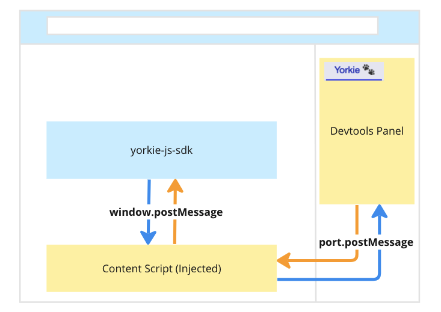
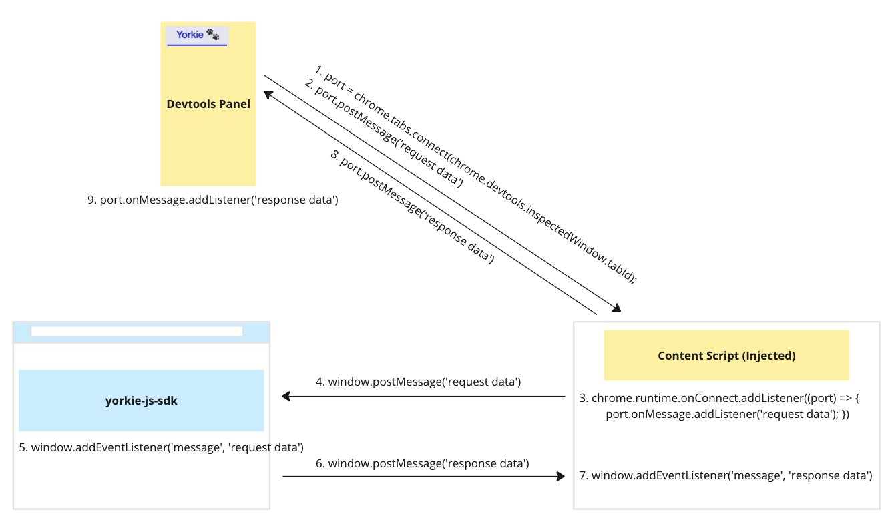
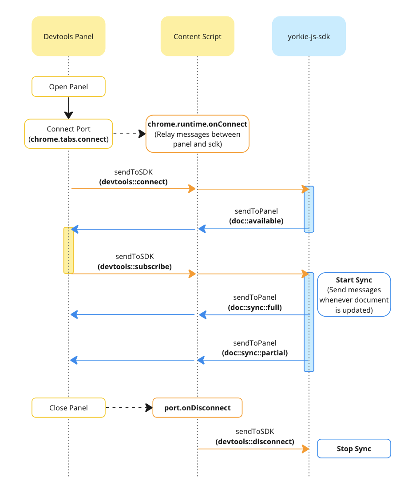
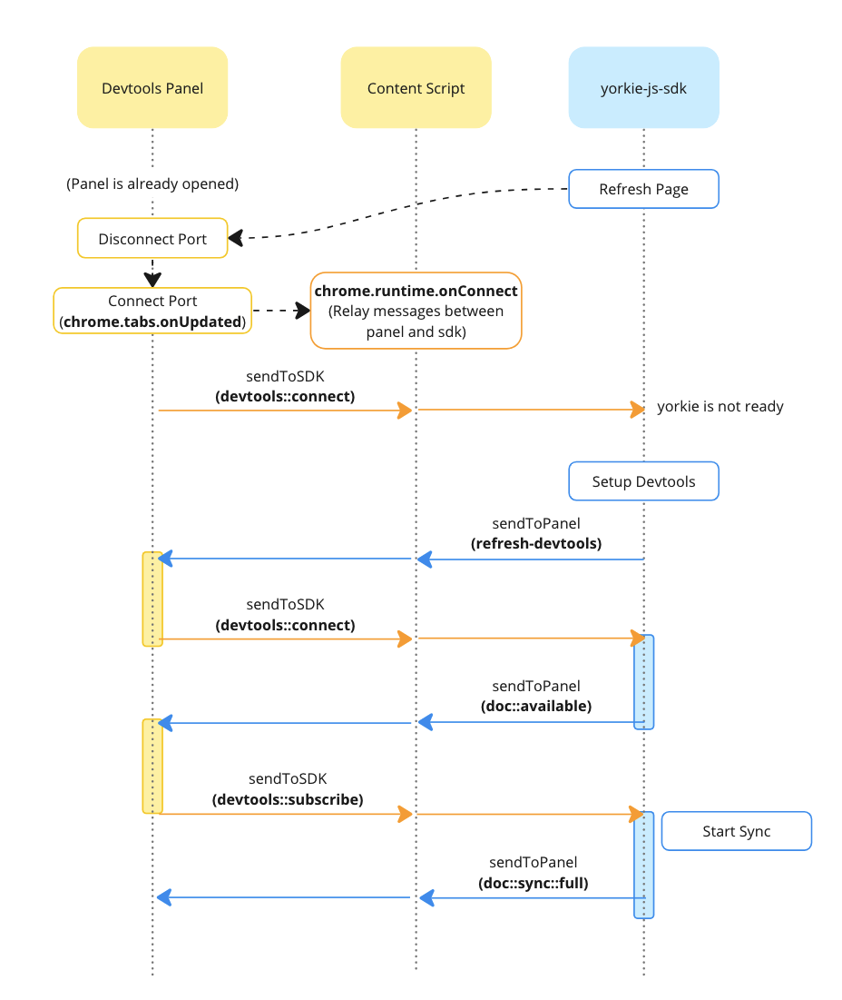

# Devtools

## Summary

[Yorkie Devtools](https://github.com/yorkie-team/yorkie-js-sdk/tree/main/tools/devtools) is a Chrome extension designed to assist in debugging Yorkie. The devtools extension consists of a `panel` that displays Yorkie data and a `content script` for communication. This document examines the configuration of the extension and explains how it communicates with the yorkie-js-sdk.

### Goals

This document aims to help new SDK contributors understand overall message flow of the extension.

### Non-Goals

While this document explains the communication process and data flow within devtools, it does not cover the specifics of the data exchanged or how received data is presented.

## Proposal Details

### Devtools Extension Configuration and Message Flow

A Chrome extension consists of various files, including popups, content scripts, background scripts, etc. Among them, Yorkie Devtools utilizes a `devtools panel` to display Yorkie data and a `content script` to communicate with the SDK.

- [Devtools Panels](https://developer.mozilla.org/en-US/docs/Mozilla/Add-ons/WebExtensions/user_interface/devtools_panels)
  - When an extension provides tools useful for developers, it can add a UI for them within the browser's developer tools as a new panel.
  - `Yorkie 🐾` panel displays Yorkie data and is built using React. ([Code](https://github.com/yorkie-team/yorkie-js-sdk/blob/c0da57b3134d37cd8b113fe2c3aba612e3c89ecf/tools/devtools/src/devtools/panel/index.tsx))
- [Content Scripts](https://developer.mozilla.org/en-US/docs/Mozilla/Add-ons/WebExtensions/Content_scripts)
  - Content scripts are injected into web pages within the browser and share the context with the page, allowing access to the page's content using DOM APIs. ([Code](https://github.com/yorkie-team/yorkie-js-sdk/blob/c0da57b3134d37cd8b113fe2c3aba612e3c89ecf/tools/devtools/src/content.ts))

Content scripts play a role in passing messages between the panel and the SDK. To enable this communication between the panel and the SDK within webpages, appropriate APIs are used for each context. Communication between content script and the panel relies on Chrome's `port.postMessage` and `port.onMessage.addListener`, while communication between content script and the SDK relies on DOM's `window.postMessage` and `window.addEventListener` APIs.

The diagram below illustrates the flow when the devtools panel "requests data" from the SDK. The panel initiates a connection to the inspected window and requests messages. The content script then relays the received message from the panel to the SDK, and the SDK subsequently forwards the message back to the panel.

### Devtools Panel Lifecycle

Let's examine the lifecycle of interaction between the devtools panel and the SDK in two scenarios:

|  |    |
| :-----------------------------------------------------: | :-------------------------------------------------------: |
|    When the devtools panel is opened after page load    | When the devtools panel is open, and a new page is loaded |

#### 1. When the Devtools Panel Is Opened After Page Load

1. Upon opening the panel, it establishes a connection with the currently inspected window.
   [tabs.connect()](https://developer.chrome.com/docs/extensions/develop/concepts/messaging#connect) creates a reusable channel (port) for long-term message passing between the panel and a content script.
2. The content script confirms the port connection using `chrome.runtime.onConnect`.
3. The panel, after establishing the port connection, sends a `devtools::connect` message to the SDK.
   The content script plays a role in relaying messages between the panel and the SDK.
4. The SDK, upon receiving the `devtools::connect` message, sends a `doc::available` message to the panel, including the currently connected document key.
5. The panel, upon receiving the document key, sends a `devtools::subscribe` message to indicate its intention to subscribe to the corresponding document.
6. The SDK, upon receiving the `devtools::subscribe` message, initiates synchronization. Initially, it sends a `doc::sync::full` message with all document information, and subsequently, it sends `doc::sync::partial` data whenever there are changes to the document.
7. When the panel is closed, it is detected by the content script using `port.onDisconnect`, which then sends a `devtools::disconnect` message to the SDK.
8. The SDK, upon detecting the panel disconnection, stops synchronization.

#### 2. When the Devtools Panel Is Open, and a New Page Is Loaded

1. Upon reloading the page, the existing port connection of the panel is closed. Upon completion of the new page load (`chrome.tabs.onUpdated`), a new port connection is established.
2. The content script confirms the new port connection using `chrome.runtime.onConnect`.
3. The panel, after establishing the port connection, sends a `devtools::connect` message to the SDK.
   If yorkie-js-sdk is not ready at this point, no action is taken.
4. Subsequently, when yorkie-js-sdk creates a new document and executes the [setup devtools](https://github.com/yorkie-team/yorkie-js-sdk/blob/c0da57b3134d37cd8b113fe2c3aba612e3c89ecf/src/devtools/index.ts#L98), it sends a `refresh-devtools` message.
5. The panel, upon receiving the `refresh-devtools` message, sends `devtools::connect` message. The subsequent steps are identical to those in the first scenario (steps 1-4 to 1-8).

### Risks and Mitigation

Currently, Yorkie devtools can only inspect the entire data for changes to documents and presence. In the future, we plan to enhance devtools to show operations and changes, as well as introduce a time travel feature to observe how documents change when operations are applied.
