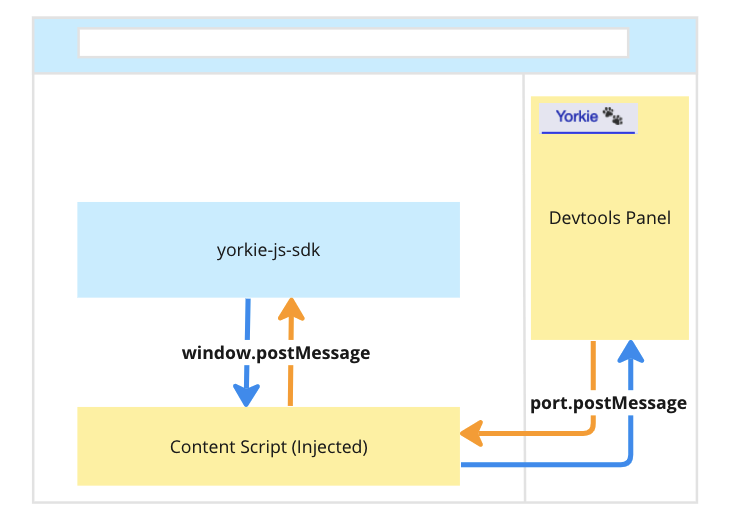
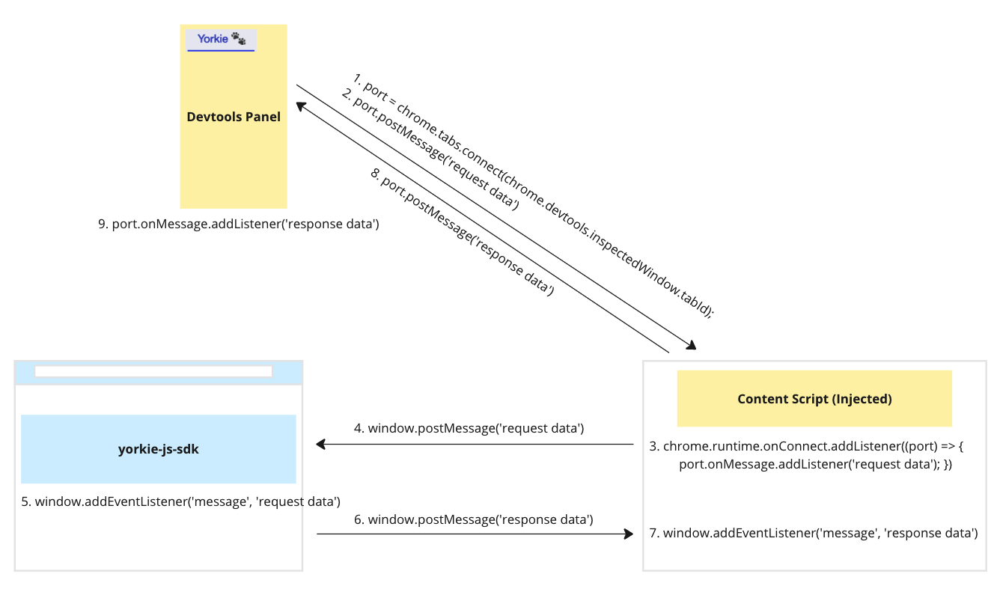
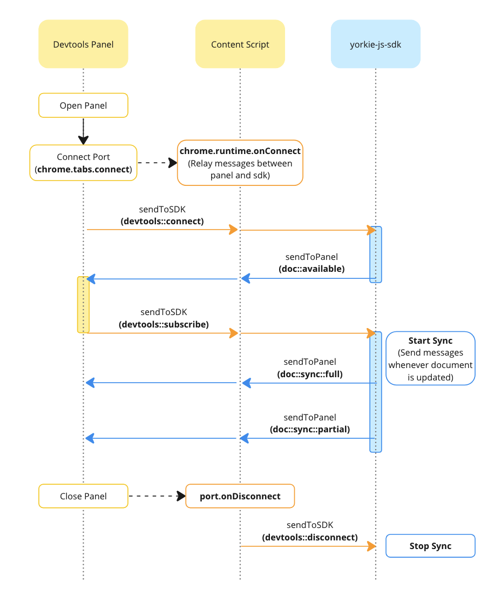
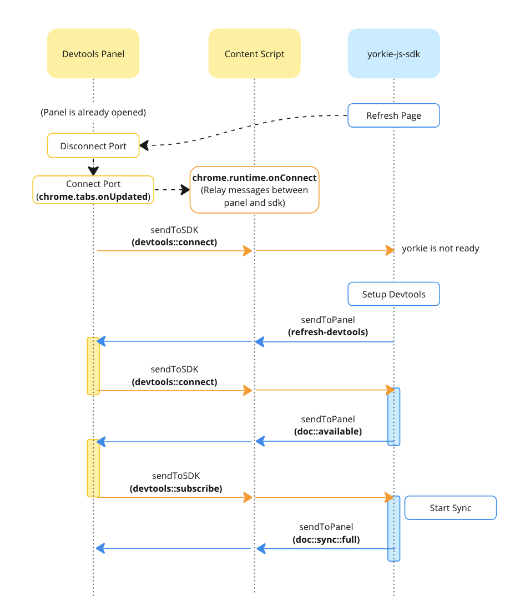

# Devtools

## Summary

Yorkie Devtools (`packages/devtools`) is a Chrome extension designed to assist in debugging Yorkie. The devtools extension consists of a `panel` that displays Yorkie data and a `content script` for communication. This document examines the configuration of the extension and explains how it communicates with the yorkie-js-sdk.

### Goals

This document aims to help new SDK contributors understand overall message flow of the extension.

### Non-Goals

While this document explains the communication process and data flow within devtools, it does not cover the specifics of the data exchanged or how received data is presented.

## Proposal Details

### Devtools Extension Configuration and Message Flow

A Chrome extension consists of various files, including popups, content scripts, background scripts, etc. Among them, Yorkie Devtools utilizes a `devtools panel` to display Yorkie data and a `content script` to communicate with the SDK.

- [Devtools Panels](https://developer.mozilla.org/en-US/docs/Mozilla/Add-ons/WebExtensions/user_interface/devtools_panels)
  - When an extension provides tools useful for developers, it can add a UI for them within the browser's developer tools as a new panel.
  - `Yorkie 🐾` panel displays Yorkie data and is built using React. (`packages/devtools/src/devtools/panel/index.tsx`)
- [Content Scripts](https://developer.mozilla.org/en-US/docs/Mozilla/Add-ons/WebExtensions/Content_scripts)
  - Content scripts are injected into web pages within the browser and share the context with the page, allowing access to the page's content using DOM APIs. (`packages/devtools/src/content.ts`)

Content scripts play a role in passing messages between the panel and the SDK. To enable this communication between the panel and the SDK within webpages, appropriate APIs are used for each context. Communication between content script and the panel relies on Chrome's `port.postMessage` and `port.onMessage.addListener`, while communication between content script and the SDK relies on DOM's `window.postMessage` and `window.addEventListener` APIs.

The diagram below illustrates the flow when the devtools panel "requests data" from the SDK. The panel initiates a connection to the inspected window and requests messages. The content script then relays the received message from the panel to the SDK, and the SDK subsequently forwards the message back to the panel.

### Devtools Panel Lifecycle

Let's examine the lifecycle of interaction between the devtools panel and the SDK in two scenarios:

|  |    |
| :-----------------------------------------------------: | :-------------------------------------------------------: |
|    When the devtools panel is opened after page load    | When the devtools panel is open, and a new page is loaded |

#### 1. When the Devtools Panel Is Opened After Page Load

1. Upon opening the panel, it establishes a connection with the currently inspected window.
   [tabs.connect()](https://developer.chrome.com/docs/extensions/develop/concepts/messaging#connect) creates a reusable channel (port) for long-term message passing between the panel and a content script.
2. The content script confirms the port connection using `chrome.runtime.onConnect`.
3. The panel, after establishing the port connection, sends a `devtools::connect` message to the SDK.
   The content script plays a role in relaying messages between the panel and the SDK.
4. The SDK, upon receiving the `devtools::connect` message, sends a `doc::available` message for **every** devtools-enabled document on the page, each carrying its own document key. The panel keeps the list, adopts the first one, and offers the rest in a selector. A document constructed later announces itself the same way.
5. The panel sends a `devtools::subscribe` message naming the document key it wants. It watches one document at a time, so subscribing to another one stops the stream of the previous.
6. The SDK, upon receiving the `devtools::subscribe` message, initiates synchronization for the requested key. It sends a `doc::sync::full` message with all document information, and subsequently `doc::sync::partial` whenever the document changes.
7. Alongside those, the SDK sends `doc::notification::full` and then `doc::notification::partial` on a second channel. It carries the events that cannot be replayed — connection and sync status, auth errors, epoch mismatches, and discarded local changes — which the panel lists separately rather than feeding to the replay pipeline. Every message on both channels carries `docKey`, and the panel drops anything that is not the document it is showing.
7. When the panel is closed, it is detected by the content script using `port.onDisconnect`, which then sends a `devtools::disconnect` message to the SDK.
8. The SDK, upon detecting the panel disconnection, stops synchronization.

#### 2. When the Devtools Panel Is Open, and a New Page Is Loaded

1. Upon reloading the page, the existing port connection of the panel is closed. Upon completion of the new page load (`chrome.tabs.onUpdated`), a new port connection is established.
2. The content script confirms the new port connection using `chrome.runtime.onConnect`.
3. The panel, after establishing the port connection, sends a `devtools::connect` message to the SDK.
   If yorkie-js-sdk is not ready at this point, no action is taken.
4. Subsequently, when yorkie-js-sdk creates a new document and executes `setupDevtools` (`packages/sdk/src/devtools/index.ts`), it sends a `refresh-devtools` message.
5. The panel, upon receiving the `refresh-devtools` message, sends `devtools::connect` message. The subsequent steps are identical to those in the first scenario (steps 1-4 to 1-8).

## Open Problems

The operation list and the time travel feature that this document once listed as future work have both shipped. The `History` tab (`packages/devtools/src/devtools/tabs/History.tsx`) records every replayable document event, renders each change's operations, and rebuilds the document at any point on the slider through `Document.applyDocEventsForReplay`. What remains:

- Operations render as `Operation.toTestString()` output rather than a structured view. `History.tsx` carries a TODO to this effect.
- Replay events are held in memory, keyed by document key, so a long editing session grows without bound. `setupDevtools` notes that external storage such as IndexedDB should replace this.
- The panel cannot tell the user that their SDK is too old to speak the current message protocol. A `doc::sync::full` message without `events` is silently dropped in `YorkieSource.tsx`.
